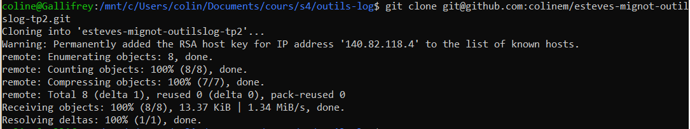
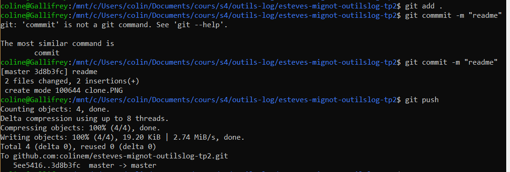
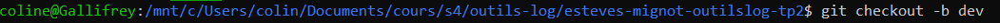
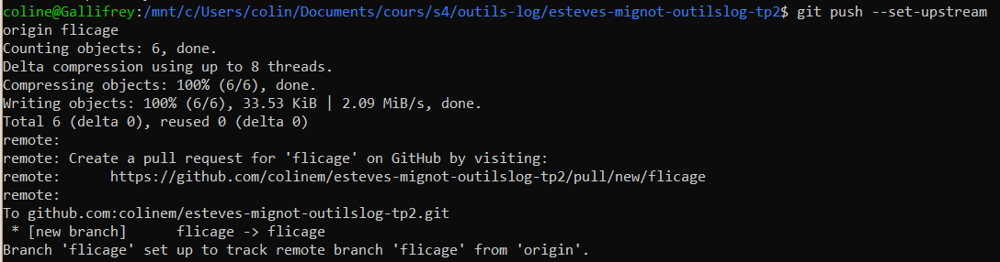
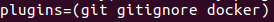
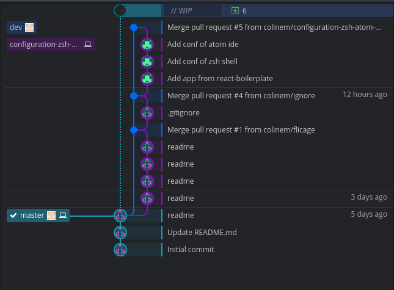

# esteves-mignot-outilslog-tp2
## Initialisation du dépôt git
### Clonage du dépôt en local

### Premier commit

### Création d'une branche

### Versionning

## ZSH
### Plugins

## Git GUI
### Arbre de branches Git

##Gestion de projet sur GitLab

